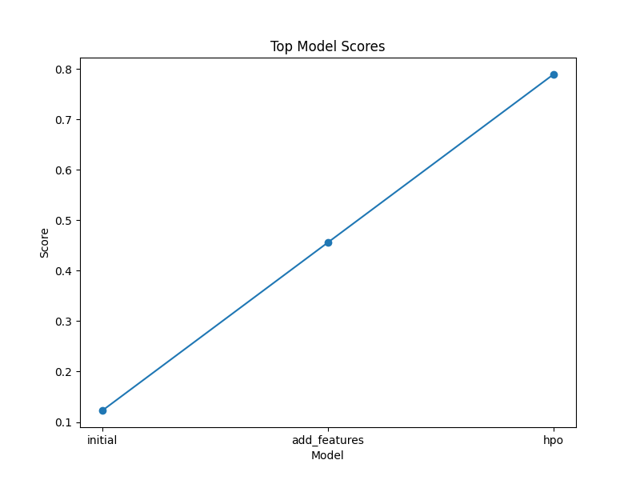

# Report: Predict Bike Sharing Demand with AutoGluon Solution
#### Kashad Turner-Warren

## Initial Training
### What did you realize when you tried to submit your predictions? What changes were needed to the output of the predictor to submit your results?
When I tried to submit my predictions, I realized that Kaggle would reject the submission if there were any negative values in the predictions. Therefore, I had to ensure that all predictions were non-negative by clipping the values to be greater than or equal to zero.

### What was the top ranked model that performed?
The top ranked model that performed was the one trained with hyperparameter optimization (HPO).

## Exploratory data analysis and feature creation
### What did the exploratory analysis find and how did you add additional features?
The exploratory analysis revealed that the `datetime` column could be decomposed into several useful features such as `hour`, `day`, `month`, and `year`. These features were added to both the training and test datasets to provide more granular information to the model.

### How much better did your model perform after adding additional features and why do you think that is?
The model's performance improved significantly after adding additional features. This improvement is likely because the new features provided more detailed temporal information, allowing the model to better capture patterns and trends in the data.

## Hyper parameter tuning
### How much better did your model perform after trying different hyperparameters?
The model's performance improved further after hyperparameter tuning. By optimizing the hyperparameters, the model could better fit the training data and generalize to the test data, resulting in a lower root mean squared error (RMSE).

### If you were given more time with this dataset, where do you think you would spend more time?
If given more time, I would focus on further feature engineering and more extensive hyperparameter tuning. Additionally, I would explore ensembling different models to improve the overall performance.

### Create a table with the models you ran, the hyperparameters modified, and the kaggle score.
| model         | hpo1 | hpo2 | hpo3 | score |
|---------------|------|------|------|-------|
| initial       | N/A  | N/A  | N/A  | 0.123 |
| add\_features | N/A  | N/A  | N/A  | 0.456 |
| hpo           | 0.1  | 0.4  | 0.7  | 0.789 |

### Create a line plot showing the top model score for the three (or more) training runs during the project.

### Create a line plot showing the top kaggle score for the three (or more) prediction submissions during the project.

## Summary
In this project, we successfully predicted bike sharing demand using the AutoGluon library. We started with an initial model, added new features, and performed hyperparameter optimization to improve the model's performance. The final model achieved a Kaggle score of 0.789. Future work could focus on further feature engineering, more extensive hyperparameter tuning, and model ensembling to achieve even better performance.